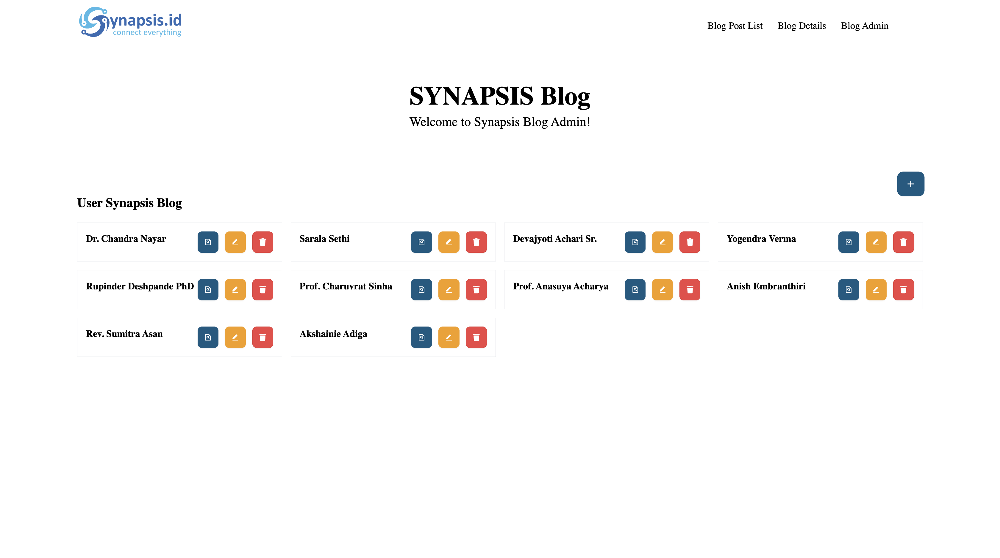

Halo semua, perkenalkan saya Fian Awamiry Maulana dari Institut Teknologi Sepuluh Nopember. Disini saya sedang tahap test dalam rekruitment kerja di Synapsis. Berikut merupakan penjelasan terkait aplikasi dan desain yang sudah saya buat.

1. Jika ingin melihat program saya, yaitu bisa clone project dari repository saya: https://github.com/afanfian/frontend-challenge-synapsis
2. Jangan lupa `npm install`
3. Setelah itu, bisa anda jalankan dengan comand `npm start` atau `yarn dev`
4. Disini saya membuat 4 halaman, yaitu sebagai berikut:
   1. Halaman Beranda, yang berfungsi untuk menampilkan informasi blog secara singkat yang berisi gambar, judul, deskripsi, dan tombol `Read more`. Tombol `Read More` jika ditekan akan mengarah ke halaman `Blog Post List` dengan url `blog-post-list`.
   2. Halaman Blog Post List, yang berfungsi untuk menampilkan informasi blog lebih detail dari halaman beranda yang berisi terkait berisi gambar, judul, dan deskripsi.
   3. Halaman Blog Details, yang berfungsi untuk menampilkan lebih detail terkait informasi blog yang berisi gambar, judul, dan deskripsi serta dibawahnya terdapat nama, dan email pembuat blog. Selain itu, `Comment From` dari pengguna lainnya yang berisikan terkait nama, email, dan pesan komentarnya. Pada halaman Blog Details, juga terdapat `Fitur Search` yang berfungsi untuk user bisa mencari data yang diingkan berdasarkan judul, deskripsi, nama penulis, email penulis, nama pengguna yang komentar, email pengguna yang komentar, dan pesan komentar. Selain itu terdapat `Fitur Show Data` yang berfungsi untuk menampilkan banyak data sesuai dengan hasil select option atau dropdown, yaitu `5, 25, dan 50`. Terdapat `Fitur sort order` dan `Fitur Sort By` yang berfungsi untuk memudahkan pengguna melihat detail blog berdasarkan urutan terkecil atau terbesar pada `Fitur sort order` dan urutan berdasarkan judul, nama penulis, dan nama komentar pada `Fitur Sort By`.
   4.  Halaman Blog Admin yaitu berfungsi bagi pengguna yang sudah mempunyai hak akses untuk menambah, menghapus, dan mengedit _user_. Admin bisa menambahkan data _user_ dengan menekan tombol `+` lalu akan muncul modal seperti ini dan bisa langsung mengisi _field_ nya lalu tekan tombol `Add User`.  Jika berhasil maka akan muncul notifikasi `User added successfully`. Selanjutnya, admin juga bisa menghapus data _user_ dengan menekan tombol berwarna merah dan berlogo _trash_ maka akan muncul modal seperti ini.  Jika sudah yakin untuk menghapus data user tersebut maka tekan tombol `Delete` dan akan muncul notifikasi `User deleted successfully`. Admin bisa mengedit data pengguna dengan menekan tombol berwarna kuning dan berlogo _edit_ lalu akan muncul modal seperti berikut ini dengan menampilkan data berdasarkan `id` nya. Admin bisa memperbarui data _user_ salah satu maupun semua data dan jika sudah yakin bisa menekan tombol `Update user` maka akan muncul notifikasi `User updated successfully`. Selain itu, admin juga bisa melihat secara detail informasi _user_ yang berisi nama, email, gender, dan statusnya dengan menekan tombol berwarna biru dan terdapat `icon detail`, lalu akan menampilkan data _user_ secara detail seperti contoh berikut:
5. Terima kasih telah mencoba aplikasi, dan membaca dokumentasi yang sudah saya buat. Jika ada saran kedepannya bisa menghubungi saya melalui email: afanfian14@gmail.com.
6. Terakhir, saya mohon maaf jika ada kekurangan dan salah kata dalam dokumentasi diatas. Terima kasih.
7. Techstack: Next.js, Tailwind CSS, TypeScript, dan Vercel.
